<p align="center">
  <a href="https://myselfpavan.vercel.app"></a>
  <a href="https://www.linkedin.com/in/pavan-patel-559195261/"></a>
  <a href="https://x.com/pavan_pate78009"></a>
  <a href="mailto:pavanpatela5598@gmail.com"></a>
</p>

> Bad systems fail loudly. Mine would fail **quietly** — a scam gets through, a benchmark scores
> an agent that did nothing, a crisis message gets a cheerful reply.
> So I build the thing. Then I build the thing that catches it lying.

**Four things, across everything I ship:** a rule engine that runs before any model · a human gate
in front of anything autonomous · a verifier I actively try to cheat · and a number attached to
every claim.

---

## 01 · Interception at the edge

Fraud detection for first-time digital payers, in the language they actually speak.



Rules run **first** — on device, no network. Retrieval runs **second**, so the model argues from
evidence, not vibes. The model runs **last**, and only explains a verdict it was handed. It never
invents one.

| | |
|---|---|
| **Surface** | Android (Kotlin) · React 19 + TypeScript · FastAPI |
| **Retrieval** | Postgres + `pgvector`, embeddings computed locally — zero API cost per scan |
| **Judgement** | Primary model, automatic fallback, grounded on top-k retrieved patterns |
| **Voice** | Call snippets transcribed on-box, then down the same path as text |
| **Reach** | 12 languages, both scripts, in and out |
| **Privacy** | Row-Level Security — scan history is invisible to everyone, me included |
| **Scale** | 82 commits · 204 files · 4 people · 97 PRs, every one reviewed |

<details>
<summary><b>The hard parts</b></summary>

<br />

- **Semantic caching.** The same scam hits thousands of times. Judging it twice is money on fire — identical text resolves from cache and never reaches a model.
- **Provenance in the trace.** Every verdict records where each pattern came from. A verdict you can't trace is a rumour.
- **Silent failure is the real bug.** The app now says out loud when scanning works but the warning can't reach the user.
- **Earned confidence only.** No corpus behind a verdict? It says so.
- **R8 on for release**, CI proving shrinking didn't break it, artifacts signed.

</details>

---

## 02 · Agents, and the line they don't cross

Seven agents across one system. **Not one sits between a user and a verdict they act on in seconds.**



> **The rule:** agents go where the work is open-ended and a human can review it.
> Never in the hot path. Speed, determinism and auditability aren't tradeable there.

- **Typed contracts, not conversation.** Finder → judge → curator → human. Every handoff is a schema. Free-form agent chatter is the bug, not the feature.
- **Policy outside the model.** For the agent that opens hostile URLs, a second model never sees page text. Blocking is tiered — never one signal, never the page's opinion of itself.
- **Prompt injection is assumed.** A page instructing the agent that reads it is expected input, not an incident.
- **Every loop has a stop condition, a budget, a kill switch.** Over budget stops the run. It never degrades quietly into something cheaper and wrong.
- **Drafts only.** Nothing an agent writes reaches a user until a person accepts it. The gate is the design, not a crutch.
- **One agent attacks us on purpose.** A red-team loop mutates known scams until they slip through. Every escape becomes a benchmark case with a lifecycle — fixed ones close.
- **A2A belongs at the institution boundary.** Inside one system it's discovery, negotiation and a wire protocol I don't need — all attack surface. Between organisations, it's the right answer. Not before.

### Orchestration, concretely

The red-team loop, four roles, one job each — because a single "be creative" prompt produces one
kind of output and calls it diversity:

| Role | Job | Why it's separate |
|---|---|---|
| **Generator** | one seed scam + **one** mutation lens → N variants | Diversity has to be structural, not requested |
| **Detector** | variant → verdict from the **production** path | A copy of the pipeline measures a system we don't ship |
| **Preservation judge** | is this still the same fraud? | Load-bearing. A variant that stopped asking for an OTP isn't an evasion — it's a different message |
| **Curator** | dedup, cluster, write corpus rows | Plain code. Not everything needs to be an agent |

The lenses are named, not improvised: transliteration, code-mixing, sentence splitting,
politeness shift, homoglyph obfuscation, paraphrase, length padding.

**Loop control:** stop after **K=2 consecutive rounds producing nothing new** — deduping against
everything ever *seen*, not everything *accepted*, or rejected variants reappear forever and the
loop never converges. Hard budget cap per run. Nightly and pre-release. Never in the request path.

The same instinct outside this system: in a mental-wellness assistant, **crisis detection sits in
front of the chat model, not inside it.** A model deciding on its own whether someone is in
danger is a design I won't ship.

---

## 03 · I write the exams frontier agents fail

Container-isolated benchmark tasks: one sealed image, a prompt, a digest-pinned environment, a
reference solution, and a verifier that has to be impossible to cheat.

`▸` **Nonlinear dynamics.** Two-module enzymatic oscillator, four coupled ODEs, shared cofactor
pool. Recover three hidden rate constants from a noisy partial series, forecast under a new feed
rate, then locate and *classify* the Hopf bifurcation where oscillation starts. The difficulty
lives in the first Lyapunov coefficient. Expert time estimate: **8 hours.**

`▸` **SQL that punishes shortcuts.** Weekly retention cohorts over an event log carrying every
scar of a real pipeline — webhook retries, mixed timezone offsets, and identity merges that are
**time-gated and multi-hop**. An event before a merge must not route through it; a later event
with the same raw id must. Canonical-id resolution stops being a lookup and becomes a walk.



**The verifier matters more than the task.** A grader that asks *"did a file appear?"* loses to
`touch`. So I corrupt one field of my own reference solution and re-run: three tests still pass,
the fourth catches it, **reward drops to zero.** Only then is the task real.

<details>
<summary><b>Repair work — what I fix in a benchmark that's already broken</b></summary>

<br />

| Defect | Why it invalidates the benchmark |
|---|---|
| Artifact path pointed where nothing was written | Every run fails for a reason unrelated to the agent |
| Unpinned base image | The environment drifts; last month's score means nothing |
| Reference solution left in the agent's image | The agent reads the answer instead of solving |
| Verifier checked existence, not values | `touch output.json` scores full marks |
| Reward written to the wrong path | Silent zero, forever |
| Vague instructions, unnumbered criteria | Two graders, two scores, no signal |

Proof: a deliberately bugged solution failed **only** the test tied to the corrupted field. The
other three passed. Field-level, not file-exists.

</details>

---

## 04 · The rest of the map

Same discipline, different domains. Every one of these is code I wrote, not a template I forked.

**Safety-critical systems**

| | |
|---|---|
| **[Raksha AI](https://github.com/CODER7657/raksha-ai)** | Multilingual fraud interception — Android + web + RAG backend, agent layer, provenance trace |
| **[POCSO Shield](https://github.com/CODER7657/CRAFTATHON)** | Anonymous child-safety reporting: layered FastAPI, Celery pipelines, on-chain registry, IPFS evidence. Anonymity and accountability in one system |
| **[Mental-wellness assistant](https://github.com/CODER7657/genex-prj)** | Chat backend with crisis detection in front of the model, session persistence, security middleware |

**Money, rules and audit trails**

| | |
|---|---|
| **[ComplyLite](https://github.com/CODER7657/complylite)** | Compliance surveillance for brokers — YAML rule packs + ML, tested detectors, CI, audit-ready output. Explainability *is* the product |
| **[TradeX](https://github.com/CODER7657/tradex)** | Trading platform: FastAPI service layer over a **Rust** execution engine, Dockerised |

**On-chain**

| | |
|---|---|
| **[VortiFi](https://github.com/CODER7657/VortiFi)** | Solidity voting contract + React DApp — verifiable elections, no trusted tallier |
| **[VeriServe](https://github.com/CODER7657/VeriServe_block)** | Certificate issuance and verification on Polygon, wallet-authenticated |

**ML, closer to the metal**

| | |
|---|---|
| **[Voice emotion detection](https://github.com/CODER7657/voice-emotion-detection)** | CNN over RAVDESS, real-time classification from live audio, with a test harness |
| **Benchmark task suite** | Authored + repaired agent-benchmark tasks — scientific computing and analytical SQL (§03) |

---

## 05 · Stack, live

<table>
<tr>
<td width="46%" valign="top">



</td>
<td valign="top">

**How I work**

`▸` **Evidence or it doesn't ship.** A claim with no number is a hope.

`▸` **Offline first.** The device does the urgent part. Network is an upgrade, not a dependency.

`▸` **Deterministic where it counts.** Same input, same verdict — or it isn't a security product.

`▸` **Fail visibly.** Silent degradation is the most expensive bug class there is.

`▸` **Boring where it's dangerous.** Rules and schemas in the hot path. Creativity behind a gate.

`▸` **Delete the claim before you defend it.** If a window wasn't protected, the copy says so.

</td>
</tr>
</table>

---

## 06 · My commit log is the spec

Real titles, real merges. This is the whole personality:

```text
Stop claiming protection across a window where there was none
Say when a verdict had no corpus behind it
Stop the test suite reading the developer's real credentials
Stop the corpus README claiming nine languages have no rules
Make it visible when scanning works but warnings cannot reach the user
Stop paying to judge the same scam a thousand times
Stop agents from spending the quota a scan needs
Make the verdict trace a specification, before a third engine implements it
```

A large share of my merged work deletes a lie the codebase was telling. Not pessimism — the only
way a safety product earns the word.

---

## 07 · Also

**Two undergraduate degrees, in parallel** — B.E. Computer Engineering, and a B.S. in Computer
Science at BITS Pilani. Two curricula, one operating system, no extensions requested.

<p align="center">
  
  
</p>

<p align="center">
  <b>Building something that has to be right the first time?</b><br />
  <a href="mailto:pavanpatela5598@gmail.com">pavanpatela5598@gmail.com</a> ·
  <a href="https://www.linkedin.com/in/pavan-patel-559195261/">LinkedIn</a> ·
  <a href="https://x.com/pavan_pate78009">X</a>
</p>

<p align="center"><sub>Every diagram above is hand-written SVG in <code>/assets</code>. No badge generators, no templates. Same as the rest of the work.</sub></p>
