[portfolio](https://myselfpavan.vercel.app) · [linkedin](https://www.linkedin.com/in/pavan-patel-559195261/) · [x](https://x.com/pavan_pate78009) · [pavanpatela5598@gmail.com](mailto:pavanpatela5598@gmail.com)

---

Bad systems fail loudly. Mine would fail quietly — a scam gets through, a benchmark scores an
agent that did nothing. So I build the thing, then I build the thing that catches it lying.

**Evals.** 22 container-isolated benchmark tasks, authored. Harbor + Docker, digest-pinned, with
verifiers built to be un-gameable — nothing counts until the oracle scores 1.00, an agent that
does nothing scores 0.00, and a solution I sabotaged myself also scores 0.00.
→ [a broken task, taken apart](https://github.com/CODER7657/fix-broken-Terminal-Bench-2-Harbor-)

**Fraud interception.** Rules first on device, retrieval second, model last — so a verdict is
explained from evidence, never invented. 12 languages, Android + web, RLS-isolated history.
→ *raksha-ai · private for now, happy to walk through it*

**Agent safety.** Seven agents, none of them in the path between a user and a verdict. Typed
contracts instead of chatter, a human gate in front of anything users see, a kill switch and a
budget on every loop.

---

### Work

| | | |
|---|---|---|
| raksha-ai *(private)* | 82 commits | Fraud interception — Kotlin · React 19 · FastAPI · pgvector |
| [complylite](https://github.com/CODER7657/complylite) | 35 commits | Compliance surveillance — rule packs + ML, tested detectors, CI |
| [VortiFi](https://github.com/CODER7657/VortiFi) | 18 commits | Verifiable on-chain elections — Solidity + React |
| [CRAFTATHON](https://github.com/CODER7657/CRAFTATHON) | 17 commits | Anonymous child-safety reporting — FastAPI · Celery · IPFS |
| [genex-prj](https://github.com/CODER7657/genex-prj) | 10 commits | Wellness chat — crisis detection in front of the model |
| tradex *(private)* | Rust + Python | Trading platform — FastAPI over a Rust execution engine |

### Stack

```text
  languages   Python · TypeScript · JavaScript · Rust · Kotlin · SQL · Solidity
  backend     FastAPI · Node.js · Celery · Redis · PostgreSQL · pgvector · Supabase
  frontend    React 19 · Tailwind · Vite · Android
  ai          RAG over pgvector · local embeddings · Groq · Gemini · on-box transcription
  evals       Harbor · Docker · pytest · NumPy · SciPy
  ops         GitHub Actions · Docker Compose · R8 · signed release builds
```

---

<sub>B.E. Computer Engineering · B.S. Computer Science, BITS Pilani — two undergraduate degrees, in parallel.</sub>
